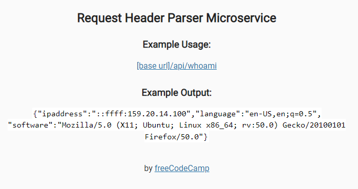

# Request Header Parser Microservice

- This API allows getting user browser information.

- Since this is a backend pactice, the interface is just for testing and provided by FreeCodeCamp.

Technologies used: Javascript, NodeJS

# Live Version



# Running Locally

To run this locally, run the following commands in a terminal:

```
npm install
npm start
```

# Requirements

- A request to /api/whoami should return a JSON object with your IP address in the ipaddress key.
- A request to /api/whoami should return a JSON object with your preferred language in the language key.
- A request to /api/whoami should return a JSON object with your software in the software key.